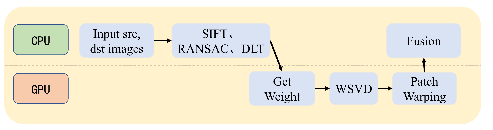
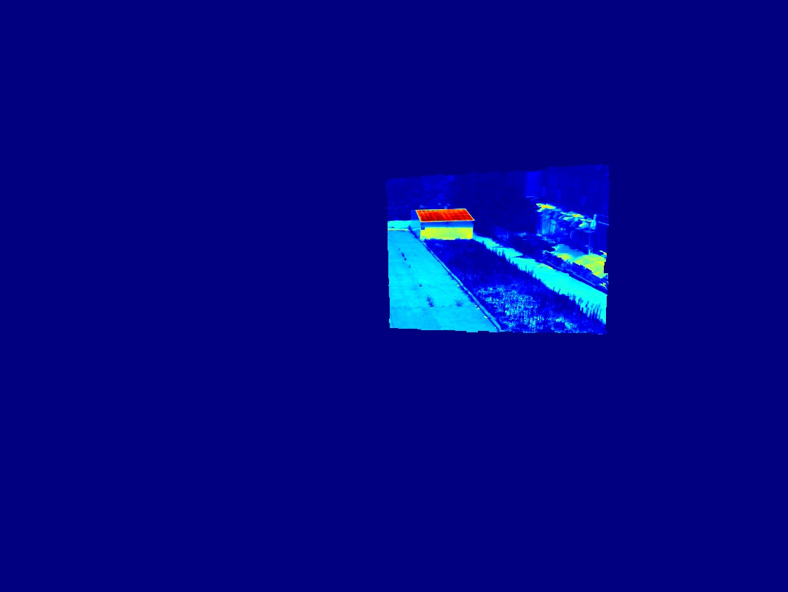
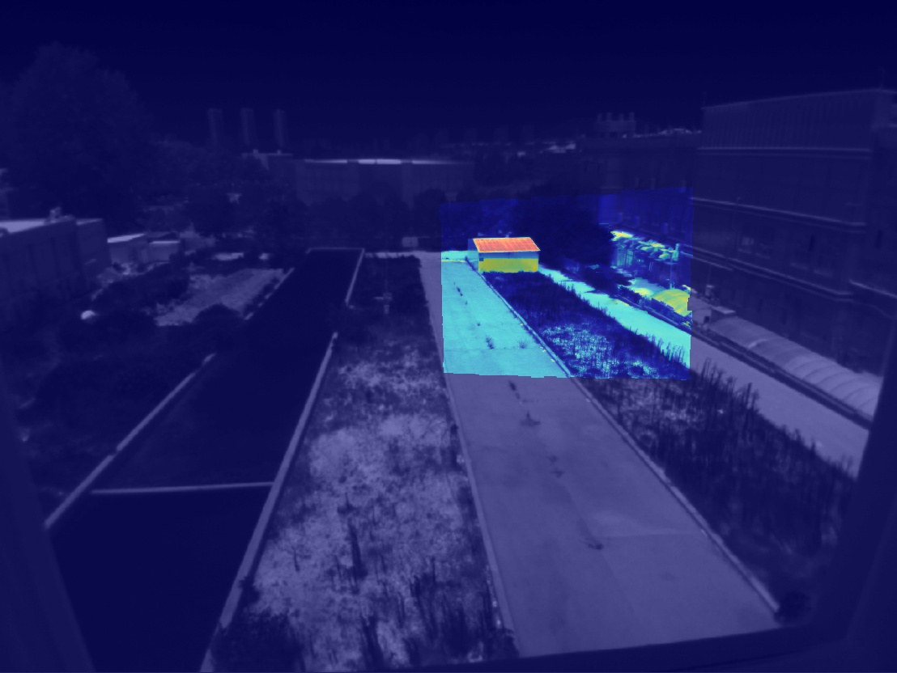

# CUDA-APAP

## 一、介绍

使用CUDA对图像拼接算法APAP(As Projective As Possible With Moving DLT)中并行的部分(比如分patch计算权重、WSVD，变换等操作)进行GPU加速。

* 依赖

  `OpenCV 4.5.0`、`OpenCV-contrib 4.5.0`、`cuSolver`、`CUDA 10.1`

**注意：** `OpenCV3`与`OpenCV4`关于SIFT使用接口不同

## 二、算法流程

1. 输入src, dst图像，需要估计src-to-dst变换。
2. 转灰度图像，利用SIFT进行特征点检测并计算特征点描述子(`OpenCV`&`OpenCV-Contrib`)。
3. Brute-force 匹配器进行2NN匹配，使用单应性矩阵RANSAC过滤错误匹配。
4. 使用DLT算法计算全局单应性矩阵，并确定变换图像尺寸。
5. 调用GPU，计算每个Patch中心到匹配点的权重。
6. 调用GPU，对每个Patch进行加权奇异值分解(WSVD)计算局部单应性矩阵（`cuSolver`）。
7. 调用GPU，对每个Patch按照局部单应性矩阵进行变换。
8. 把变换图像从GPU转移至CPU，与dst图像融合。

**备注**：由于`cuSolver`批量对矩阵进行奇异值分解仅支持32 x 32维以下的矩阵，因此算法按照距离取最近16个特征点进行截断。

## 三、效果

### 3.1 SIFT + RANSAC

<h6 align="center"> 左图是源图像(src)，右图是目标图像(dst)，需要估计src-to-dst的变换</h6>

### 3.2 变换和融合效果

<h6 align="center"> 左图是变换后的源图像(伪彩色增强)，右图是与目标图像融合图像</h6>

## 四、参考资料

#### 4.1 参考文献和代码

[1] Zaragoza, J, Chin, et al. As-Projective-As-Possible Image Stitching with Moving DLT[J]. Pattern Analysis & Machine Intelligence, 2014.

[2]  [APAP-官方Matlab代码](https://cs.adelaide.edu.au/~tjchin/apap/#Source)

[3] [python-APAP](git@github.com:EadCat/APAP-Image-Stitching.git)

[4] [stackoverflow-cuda批量计算SVD](https://stackoverflow.com/questions/17401765/parallel-implementation-for-multiple-svds-using-cuda)

[5] [cuSolver-批量计算SVD](https://www.coder.work/article/6753763)

[6] [cuSolver文档](https://docs.nvidia.com/cuda/cusolver/index.html#cuSolverDN-function-reference)

#### 4.2 依赖安装

[1] [OpenCV-Contrib安装](https://blog.csdn.net/weijifen000/article/details/93377143)

[2] [缺少xxx.i错误解决方法](https://blog.csdn.net/AlexWang30/article/details/99612188)

[3] [opencv 找不到 feature2d/test/test_detectors_regression.impl.hpp 文件错误](https://blog.csdn.net/u012939880/article/details/105864932)

